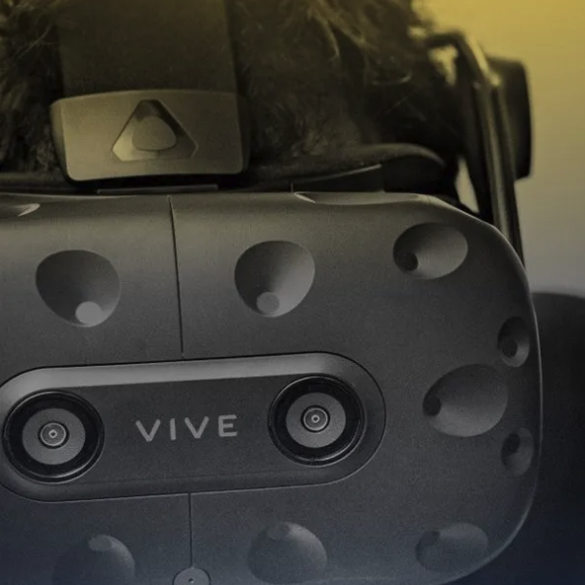

# Realistic 3D
The research at Realistic 3D is on Multidimensional Imaging and Visualization with focus on Multiscopic 3D Capture, Coding and Visualization.

The research group Realistic 3D is developing future 3D visualization for entertainment and industry, focusing on improving capture, compression, and presentation technology by making use of sophisticated signal and image processing.

## Research Focus
We pursue research, and related education, in the fields of multimedia communication systems that utilize realistic 3D as part. Our main research areas are:

* Synthesis and capture of 3D images and video
* View rendering techniques
* Modelling of 3D devices
* Coding of 3D images and video
* 3D Quality metrics and evaluations

Read more about our research work [here](https://www.miun.se/en/Research/researchgroups/realistic-3d/)

## Recent Publications
* [LFSphereNet](https://realistic3d-miun.github.io/Research/LFSphereNet/LFSphereNet.html)
* [SLFDB](https://realistic3d-miun.github.io/Research/SLFDB/SLFDB.html)

